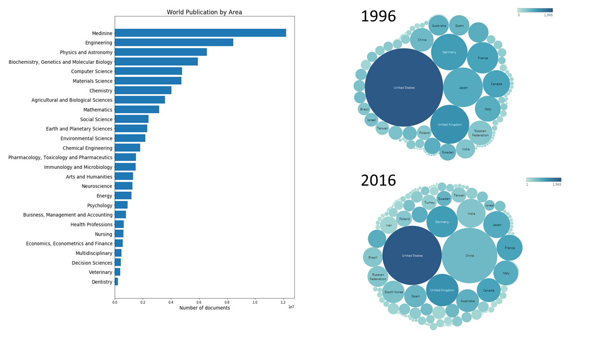

## Global research publications
[](https://isaacdu84.github.io/Global-Scientific-Publications) A data mining project that explores the Scimago Journal & Country Ranking dataset to find out the "hot topics" of scientific publicaions, trend of publications in each area from major contributors and the distribution of countries' interests/effort of research areas.<br />
**```category: data mining```**
